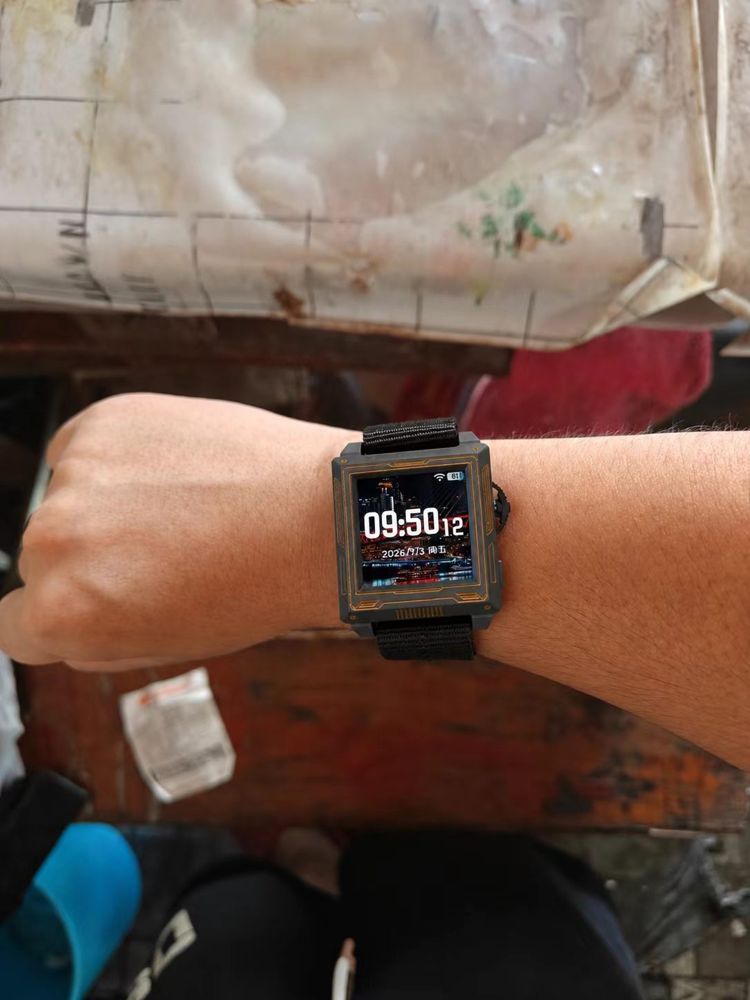
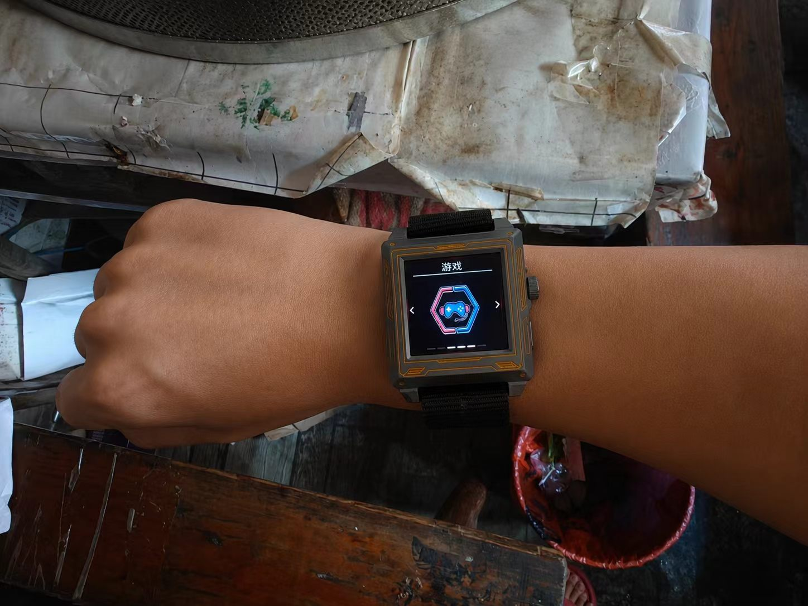
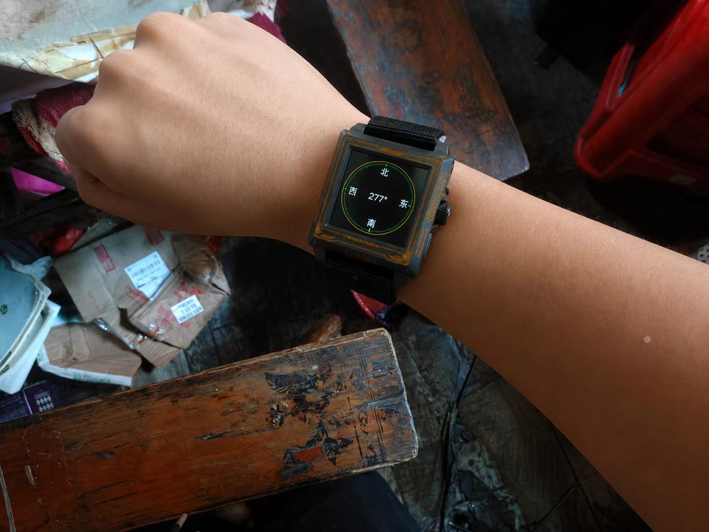
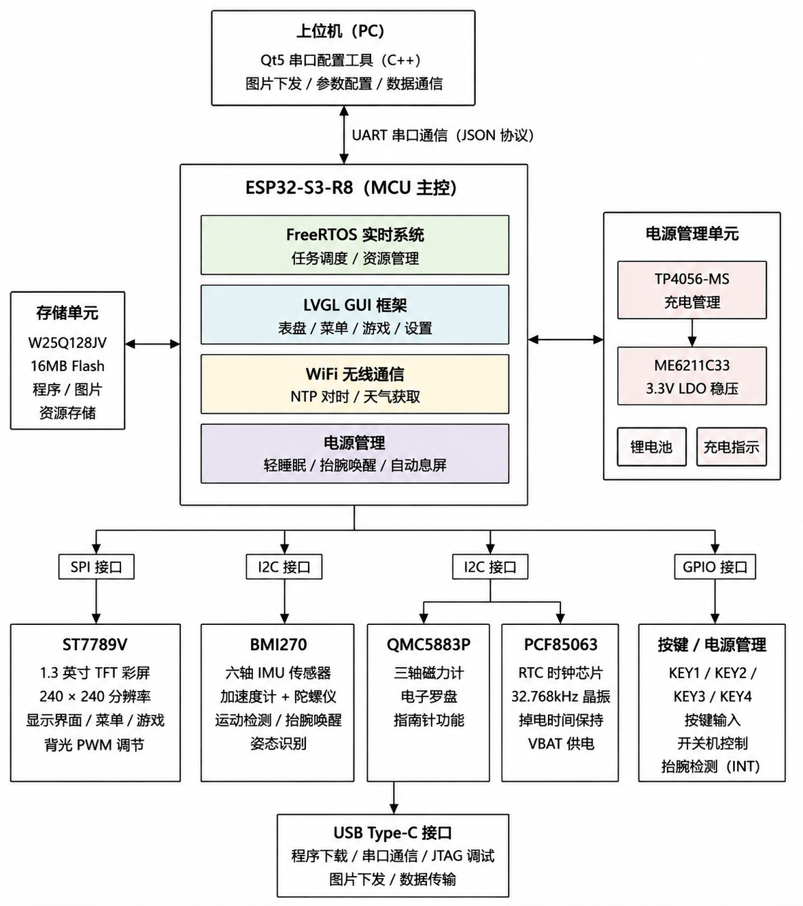

# ESP32-S3-R8 多功能智能手表

> 基于 ESP32-S3-R8 的全栈嵌入式智能穿戴项目，涵盖 **硬件设计 → 固件开发 → 上位机软件** 完整产品链路。

<p align="center">
  
  
  
</p>

<p align="center"><strong>表盘 · 游戏菜单 · 电子罗盘</strong></p>

---

## 项目简介

本项目从零设计并实现了一款多功能智能手表，完成了从 PCB 硬件设计、ESP-IDF 固件开发到 Qt5 上位机配套软件的全流程开发。手表集成了运动传感、电子罗盘、天气查询、小游戏等功能，并实现了完整的低功耗电源管理体系。

### 核心亮点

- 🔧 **全栈开发** — 独立完成硬件 PCB 设计、嵌入式固件、PC 上位机全链路开发
- ⚡ **低功耗设计** — ESP Light Sleep + 抬腕唤醒，实现超长续航
- 🎮 **丰富功能** — 表盘、罗盘、天气、计步、番茄钟、俄罗斯方块、飞机大战
- 📡 **无线通信** — WiFi NTP 对时 + HTTP 天气 API
- 🔋 **电源管理** — TP4056-MS 充电 + ME6211C33 LDO + 锂电池

---

## 系统架构



### 架构说明

| 模块 | 芯片/技术 | 功能说明 |
|------|-----------|----------|
| **主控** | ESP32-S3-R8 | 双核 Xtensa LX7，240MHz，8MB PSRAM，内置 WiFi |
| **存储** | W25Q128JV | 16MB Flash，存储程序、图片资源 |
| **显示** | ST7789V | 1.3 英寸 TFT 彩屏，240×240 分辨率，SPI 接口 |
| **IMU** | BMI270 | 六轴加速度计 + 陀螺仪，运动检测/抬腕唤醒 |
| **罗盘** | QMC5883P | 三轴磁力计，电子罗盘/指南针 |
| **RTC** | PCF85063 | 32.768kHz 晶振，掉电时间保持，VBAT 供电 |
| **电源** | TP4056-MS + ME6211C33 | 充电管理 + 3.3V LDO 稳压 |
| **通信** | WiFi + UART | NTP 对时/天气获取，JSON 协议串口通信 |

---

## 技术栈

| 层级 | 技术 | 说明 |
|------|------|------|
| **主控芯片** | ESP32-S3-R8 | 双核 Xtensa LX7，240MHz，8MB PSRAM，内置 WiFi |
| **实时系统** | FreeRTOS (ESP-IDF v5) | 多任务调度，LVGL 任务独立运行于 Core 1 |
| **GUI 框架** | LVGL v9 | 嵌入式图形库，自研表盘与多页面 UI |
| **显示驱动** | ST7789V (SPI) | 240×240 彩屏，自研驱动层 + 背光 PWM |
| **运动传感** | BMI270 (I2C) | 六轴 IMU，计步、抬腕唤醒、中断驱动 |
| **电子罗盘** | QMC5883P (I2C) | 三轴磁力计，罗盘方位计算 |
| **实时时钟** | PCF85063 (I2C) | 32.768kHz 晶振，掉电保持 |
| **存储** | W25Q128JV (SPI) | 16MB Flash，资源存储 |
| **无线通信** | WiFi (ESP-IDF) | NTP 网络对时、HTTP 天气 API |
| **电源管理** | TP4056-MS + ME6211C33 | 充电 + LDO，ESP Light Sleep |
| **上位机** | Qt5 (C++) | 串口通信、JSON 协议、配置读写、图片传输 |
| **硬件设计** | EasyEDA | PCB 设计、Gerber 输出、BOM 管理 |

---

## 功能特性

### 核心功能
- **多页面表盘 UI** — 基于 LVGL 自研表盘、菜单系统，支持按键导航
- **电子罗盘** — QMC5883P 磁力计实时方位指示（0°-360°）
- **天气查询** — WiFi 联网获取实时天气信息
- **NTP 网络对时** — 自动同步网络时间至 PCF85063 RTC
- **计步器** — BMI270 加速度数据驱动的步数统计
- **番茄钟** — 时间管理工具

### 内置小游戏
- **俄罗斯方块** (Tetris) — 完整游戏逻辑与得分系统
- **飞机大战** (Plane War) — 射击游戏，含敌机、得分、结算界面

### 电源管理
- **抬腕唤醒** — BMI270 数据就绪中断 + 手势检测算法
- **自动息屏** — 15 秒无操作自动进入轻睡眠
- **按键唤醒** — KEY4 短按唤醒，长按关机
- **电源自锁** — GPIO18 控制电源保持，支持软件关机
- **WiFi 智能管理** — 息屏自动断开 WiFi 以降低功耗
- **USB Type-C** — 程序下载 / 串口通信 / JTAG 调试 / 图片下发

### 上位机工具 (Qt5)
- 串口连接与配置读写
- 自定义表盘封面、二维码图片上传
- JSON 通信协议解析与日志显示

---

## 硬件资源占用

| 外设 | 引脚/接口 | 说明 |
|------|-----------|------|
| ST7789V LCD | SPI | 1.3" TFT 彩屏，240×240 |
| BMI270 | I2C, INT→GPIO5 | 运动传感 + 抬腕唤醒 |
| QMC5883P | I2C | 电子罗盘 |
| PCF85063 | I2C | RTC 时钟，32.768kHz |
| W25Q128JV | SPI | 16MB Flash 存储 |
| KEY1-KEY3 | GPIO | 导航按键 |
| KEY4 | GPIO21 | 电源/唤醒按键 |
| 电源自锁 | GPIO18 | 电源保持控制 |
| USB Type-C | — | 下载/调试/通信 |

---

## 目录结构

```
esp32-multifunctional-watch-master/
├── 01_Hardware/                 # 硬件设计
│   ├── ESP32-Watch-BOM.xlsx     # 物料清单
│   ├── Gerber_ESP32-Watch.zip   # Gerber 制造文件
│   └── *.epro2                  # EasyEDA 工程文件
├── 02_Firmware/                 # 预编译固件与工具
│   ├── ESP32-S3-WATCH-V1.2_full.bin  # 完整固件镜像
│   ├── flash_download_tool/     # ESP 烧录工具
│   └── ESP-Watch-UpperComputer-Package/  # 上位机可执行程序
├── 03_Software/                 # 全部源代码
│   ├── ESP32-S3-WATCH-Code/     # ESP-IDF 固件源码
│   │   ├── main/                # 应用主程序
│   │   │   ├── main.c           # 入口 + 电源管理
│   │   │   ├── lcd_st7789_*     # ST7789V 显示驱动
│   │   │   ├── lvgl_port.*      # LVGL 移植层
│   │   │   ├── watch_bmi270.*   # BMI270 IMU 驱动
│   │   │   ├── watch_compass.*  # QMC5883P 罗盘
│   │   │   ├── watch_wifi.*     # WiFi 通信
│   │   │   ├── watch_weather.*  # 天气获取
│   │   │   ├── watch_game.*     # 俄罗斯方块
│   │   │   ├── watch_plane_war* # 飞机大战
│   │   │   ├── watch_tomato_*   # 番茄钟
│   │   │   ├── watch_battery.*  # 电池监测
│   │   │   ├── watch_rtc.*      # RTC (PCF85063)
│   │   │   ├── time_sync.*      # NTP 对时
│   │   │   └── ...              # 其他功能模块
│   │   └── components/lvgl/     # LVGL 组件库
│   └── ESP-Watch-UpperComputerv1.1/  # Qt5 上位机源码
│       ├── widget.cpp/h         # 主逻辑（串口/JSON/配置）
│       └── widget.ui            # UI 设计文件
└── images/               # README 图片资源
```

---

## 快速开始

### 烧录预编译固件
1. 进入 `02_Firmware/flash_download_tool/` 运行烧录工具
2. 选择 `02_Firmware/ESP32-S3-WATCH-V1.2_full.bin`
3. 烧录地址 `0x0`，波特率 115200，开始烧录

### 从源码编译固件
```bash
# 设置 ESP-IDF 环境（需 ESP-IDF v5.x）
idf.py set-target esp32s3
idf.py build
idf.py -p COMx flash monitor
```

### 运行上位机
- 直接运行 `02_Firmware/ESP-Watch-UpperComputer-Package/ESP-Watch-UpperComputer.exe`
- 或使用 Qt5 从 `03_Software/ESP-Watch-UpperComputerv1.1/` 源码编译

---

## 技术亮点

- **全栈开发能力** — 独立完成硬件 PCB 设计、嵌入式固件、PC 上位机全链路开发
- **实时多任务架构** — FreeRTOS 任务调度，LVGL 独立运行于指定 CPU 核心，按键事件队列驱动
- **中断驱动低功耗** — BMI270 数据就绪中断 + ESP Light Sleep，息屏期间 CPU 进入睡眠，仅 GPIO 唤醒源活跃
- **自研显示驱动** — 直接基于 ESP-IDF LCD 驱动框架实现 ST7789V SPI 通信，集成 LVGL 移植层与背光 PWM 调节
- **多传感器融合** — I2C 总线统一管理 BMI270（运动）与 QMC5883P（地磁），实现计步与罗盘功能
- **完整电源管理** — TP4056-MS 充电 + ME6211C33 LDO + 电源自锁电路 + 软件关机 + 自动息屏 + 抬腕唤醒
- **自定义串口协议** — 上位机与手表间基于 JSON 的配置读写协议，支持图片资源传输
- **外置 Flash 存储** — W25Q128JV 16MB 存储程序、图片资源，灵活扩展

---

## 使用的开发工具

| 工具 | 用途 |
|------|------|
| ESP-IDF v5.x | ESP32-S3-R8 开发框架 |
| CMake | 固件构建系统 |
| Qt5 / Qt Creator | 上位机开发 |
| EasyEDA | PCB 硬件设计 |
| Visual Studio Code | 固件开发 IDE |
| ESP-IDF Flash Download Tool | 固件烧录 |

---

## License

本项目仅供学习交流使用。
